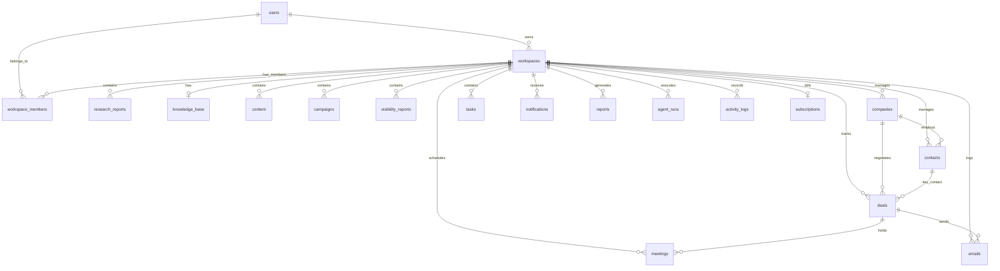

# Production Database Schema & Architecture — Eminarc Growth OS

This document provides the technical reference and data dictionary for the multi-tenant Supabase PostgreSQL database powering **Eminarc Growth OS**.

---

## 📐 Entity Relationship Diagram (ERD)



---

## 🔒 Security Model & Multi-Tenant Row Level Security (RLS)

- **Row Level Security (RLS)** is enabled across all 19 database tables.
- **Tenant Isolation Helper Function**: `public.is_workspace_member(ws_id UUID)` evaluates if the authenticated user (`auth.uid()`) holds an active record in `workspace_members` for the target workspace.
- **Soft Delete Enforcement**: All queries exclude soft-deleted records using `deleted_at IS NULL`.

---

## 📋 Data Dictionary (19 Tables)

### 1. `users` (Profiles)

Extends Supabase `auth.users` with application metadata.

| Column       | Type          | Constraints                                                  | Description                   |
| :----------- | :------------ | :----------------------------------------------------------- | :---------------------------- |
| `id`         | `UUID`        | `PRIMARY KEY`, `REFERENCES auth.users(id) ON DELETE CASCADE` | Auth User Identifier          |
| `email`      | `TEXT`        | `NOT NULL`                                                   | Primary email address         |
| `full_name`  | `TEXT`        | `NULL`                                                       | User full name                |
| `avatar_url` | `TEXT`        | `NULL`                                                       | Avatar URL                    |
| `role`       | `TEXT`        | `DEFAULT 'user'`                                             | Platform role                 |
| `metadata`   | `JSONB`       | `DEFAULT '{}'`                                               | Additional profile attributes |
| `created_at` | `TIMESTAMPTZ` | `DEFAULT NOW(), NOT NULL`                                    | Creation timestamp            |
| `updated_at` | `TIMESTAMPTZ` | `DEFAULT NOW(), NOT NULL`                                    | Auto-updating timestamp       |
| `deleted_at` | `TIMESTAMPTZ` | `NULL`                                                       | Soft delete timestamp         |

---

### 2. `workspaces`

Tenant root container representing a company workspace.

| Column           | Type          | Constraints                               | Description                             |
| :--------------- | :------------ | :---------------------------------------- | :-------------------------------------- |
| `id`             | `UUID`        | `PRIMARY KEY, DEFAULT gen_random_uuid()`  | Workspace UUID                          |
| `name`           | `TEXT`        | `NOT NULL`                                | Workspace / Company Name                |
| `domain`         | `TEXT`        | `NULL`                                    | Corporate domain name                   |
| `industry`       | `TEXT`        | `NULL`                                    | Primary industry                        |
| `brand`          | `TEXT`        | `NULL`                                    | Brand positioning tone                  |
| `country`        | `TEXT`        | `NULL`                                    | Headquarter country                     |
| `timezone`       | `TEXT`        | `NULL`                                    | Primary timezone                        |
| `logo_url`       | `TEXT`        | `NULL`                                    | Custom logo URL                         |
| `logo_letter`    | `TEXT`        | `NULL`                                    | Monogram letter preview                 |
| `status`         | `TEXT`        | `DEFAULT 'Active', NOT NULL`              | Workspace status (`Active`, `Archived`) |
| `target_market`  | `JSONB`       | `DEFAULT '["USA"]'`                       | Targeted regions array                  |
| `brand_voice`    | `JSONB`       | `DEFAULT '[]'`                            | Brand voice tags                        |
| `metrics`        | `JSONB`       | `DEFAULT '{}'`                            | Cached workspace metrics                |
| `weekly_goal`    | `JSONB`       | `DEFAULT '{}'`                            | Current weekly growth goal              |
| `knowledge_base` | `JSONB`       | `DEFAULT '{}'`                            | Inline knowledge base snapshot          |
| `owner_id`       | `UUID`        | `REFERENCES users(id) ON DELETE RESTRICT` | Workspace creator ID                    |
| `created_at`     | `TIMESTAMPTZ` | `DEFAULT NOW(), NOT NULL`                 | Creation timestamp                      |
| `updated_at`     | `TIMESTAMPTZ` | `DEFAULT NOW(), NOT NULL`                 | Auto-updating timestamp                 |
| `deleted_at`     | `TIMESTAMPTZ` | `NULL`                                    | Soft delete timestamp                   |

---

### 3. `workspace_members`

User membership and role assignments within workspaces.

| Column         | Type          | Constraints                                              | Description             |
| :------------- | :------------ | :------------------------------------------------------- | :---------------------- |
| `id`           | `UUID`        | `PRIMARY KEY, DEFAULT gen_random_uuid()`                 | Membership UUID         |
| `workspace_id` | `UUID`        | `REFERENCES workspaces(id) ON DELETE CASCADE`            | Target workspace        |
| `user_id`      | `UUID`        | `REFERENCES users(id) ON DELETE CASCADE`                 | Member user             |
| `role`         | `TEXT`        | `CHECK (role IN ('owner', 'admin', 'member', 'viewer'))` | Workspace role          |
| `created_at`   | `TIMESTAMPTZ` | `DEFAULT NOW(), NOT NULL`                                | Join timestamp          |
| `updated_at`   | `TIMESTAMPTZ` | `DEFAULT NOW(), NOT NULL`                                | Auto-updating timestamp |
| `deleted_at`   | `TIMESTAMPTZ` | `NULL`                                                   | Soft delete timestamp   |

---

### 4. `research_reports`

McKinsey-grade founder and account research reports.

| Column              | Type          | Constraints                                   | Description                                   |
| :------------------ | :------------ | :-------------------------------------------- | :-------------------------------------------- |
| `id`                | `UUID`        | `PRIMARY KEY`                                 | Report UUID                                   |
| `workspace_id`      | `UUID`        | `REFERENCES workspaces(id) ON DELETE CASCADE` | Workspace ID                                  |
| `title`             | `TEXT`        | `NOT NULL`                                    | Report title                                  |
| `company_domain`    | `TEXT`        | `NULL`                                        | Target domain researched                      |
| `industry`          | `TEXT`        | `NULL`                                        | Target industry                               |
| `icp_data`          | `JSONB`       | `DEFAULT '{}'`                                | ICP positioning data                          |
| `market_insights`   | `JSONB`       | `DEFAULT '{}'`                                | Key market findings                           |
| `competitor_matrix` | `JSONB`       | `DEFAULT '{}'`                                | Competitor comparison                         |
| `status`            | `TEXT`        | `DEFAULT 'Complete'`                          | Status (`Pending`, `In Progress`, `Complete`) |
| `created_by`        | `UUID`        | `REFERENCES users(id)`                        | Author user ID                                |
| `created_at`        | `TIMESTAMPTZ` | `DEFAULT NOW(), NOT NULL`                     | Creation timestamp                            |
| `updated_at`        | `TIMESTAMPTZ` | `DEFAULT NOW(), NOT NULL`                     | Auto-updating timestamp                       |
| `deleted_at`        | `TIMESTAMPTZ` | `NULL`                                        | Soft delete timestamp                         |

---

### 5. `knowledge_base`

Central repository storing knowledge profile, founder positioning, and market messaging.

| Column            | Type          | Constraints                                           | Description                   |
| :---------------- | :------------ | :---------------------------------------------------- | :---------------------------- |
| `id`              | `UUID`        | `PRIMARY KEY`                                         | KB UUID                       |
| `workspace_id`    | `UUID`        | `UNIQUE, REFERENCES workspaces(id) ON DELETE CASCADE` | Workspace ID                  |
| `company_profile` | `JSONB`       | `DEFAULT '{}'`                                        | Company overview              |
| `founder_profile` | `JSONB`       | `DEFAULT '{}'`                                        | Founder persona               |
| `icp`             | `JSONB`       | `DEFAULT '{}'`                                        | Target ICP criteria           |
| `products`        | `JSONB`       | `DEFAULT '[]'`                                        | Offerings list                |
| `services`        | `JSONB`       | `DEFAULT '[]'`                                        | Services list                 |
| `messaging`       | `JSONB`       | `DEFAULT '{}'`                                        | Value props & pillars         |
| `brand_voice`     | `JSONB`       | `DEFAULT '{}'`                                        | Tone rules & prohibited words |
| `competitors`     | `JSONB`       | `DEFAULT '[]'`                                        | Competitive analysis          |
| `goals`           | `JSONB`       | `DEFAULT '[]'`                                        | Strategic goals               |
| `challenges`      | `JSONB`       | `DEFAULT '[]'`                                        | Active challenges             |
| `created_at`      | `TIMESTAMPTZ` | `DEFAULT NOW(), NOT NULL`                             | Creation timestamp            |
| `updated_at`      | `TIMESTAMPTZ` | `DEFAULT NOW(), NOT NULL`                             | Auto-updating timestamp       |
| `deleted_at`      | `TIMESTAMPTZ` | `NULL`                                                | Soft delete timestamp         |

---

### 6. `content`

Content OS library, posts, strategy articles, and multi-channel repurpose items.

| Column         | Type          | Constraints                                   | Description                                    |
| :------------- | :------------ | :-------------------------------------------- | :--------------------------------------------- |
| `id`           | `UUID`        | `PRIMARY KEY`                                 | Content UUID                                   |
| `workspace_id` | `UUID`        | `REFERENCES workspaces(id) ON DELETE CASCADE` | Workspace ID                                   |
| `title`        | `TEXT`        | `NOT NULL`                                    | Headline / Title                               |
| `type`         | `TEXT`        | `DEFAULT 'Post'`                              | Type (`Article`, `Post`, `Carousel`, `Thread`) |
| `status`       | `TEXT`        | `DEFAULT 'Draft'`                             | Status (`Draft`, `Scheduled`, `Published`)     |
| `channel`      | `TEXT`        | `NULL`                                        | Channel (`LinkedIn`, `Medium`, `X`, `Email`)   |
| `body_content` | `TEXT`        | `NULL`                                        | Markdown / Post content                        |
| `scheduled_at` | `TIMESTAMPTZ` | `NULL`                                        | Scheduled publication date                     |
| `published_at` | `TIMESTAMPTZ` | `NULL`                                        | Published date                                 |
| `author_id`    | `UUID`        | `REFERENCES users(id)`                        | Author user ID                                 |
| `metadata`     | `JSONB`       | `DEFAULT '{}'`                                | Engagement stats                               |
| `created_at`   | `TIMESTAMPTZ` | `DEFAULT NOW(), NOT NULL`                     | Creation timestamp                             |
| `updated_at`   | `TIMESTAMPTZ` | `DEFAULT NOW(), NOT NULL`                     | Auto-updating timestamp                        |
| `deleted_at`   | `TIMESTAMPTZ` | `NULL`                                        | Soft delete timestamp                          |

---

### 7. `campaigns`

Multi-channel growth and outreach campaign management.

| Column            | Type            | Constraints                                   | Description                                       |
| :---------------- | :-------------- | :-------------------------------------------- | :------------------------------------------------ |
| `id`              | `UUID`          | `PRIMARY KEY`                                 | Campaign UUID                                     |
| `workspace_id`    | `UUID`          | `REFERENCES workspaces(id) ON DELETE CASCADE` | Workspace ID                                      |
| `name`            | `TEXT`          | `NOT NULL`                                    | Campaign name                                     |
| `description`     | `TEXT`          | `NULL`                                        | Summary description                               |
| `type`            | `TEXT`          | `DEFAULT 'Outreach'`                          | Type (`Outreach`, `GEO`, `Content`, `Ad`)         |
| `status`          | `TEXT`          | `DEFAULT 'Draft'`                             | Status (`Draft`, `Active`, `Paused`, `Completed`) |
| `start_date`      | `TIMESTAMPTZ`   | `NULL`                                        | Start date                                        |
| `end_date`        | `TIMESTAMPTZ`   | `NULL`                                        | End date                                          |
| `budget`          | `NUMERIC(12,2)` | `DEFAULT 0.00`                                | Budget amount                                     |
| `target_audience` | `JSONB`         | `DEFAULT '{}'`                                | Audience targeting criteria                       |
| `metrics`         | `JSONB`         | `DEFAULT '{}'`                                | Performance metrics                               |
| `created_at`      | `TIMESTAMPTZ`   | `DEFAULT NOW(), NOT NULL`                     | Creation timestamp                                |
| `updated_at`      | `TIMESTAMPTZ`   | `DEFAULT NOW(), NOT NULL`                     | Auto-updating timestamp                           |
| `deleted_at`      | `TIMESTAMPTZ`   | `NULL`                                        | Soft delete timestamp                             |

---

### 8. `visibility_reports`

Generative Engine Optimization (GEO) & LLM search citation scans across ChatGPT, Claude, Perplexity, etc.

| Column                 | Type           | Constraints                                   | Description                 |
| :--------------------- | :------------- | :-------------------------------------------- | :-------------------------- |
| `id`                   | `UUID`         | `PRIMARY KEY`                                 | Scan UUID                   |
| `workspace_id`         | `UUID`         | `REFERENCES workspaces(id) ON DELETE CASCADE` | Workspace ID                |
| `query_text`           | `TEXT`         | `NOT NULL`                                    | Evaluated search prompt     |
| `overall_score`        | `NUMERIC(5,2)` | `DEFAULT 0.00`                                | Visibility score percentage |
| `llm_citations`        | `JSONB`        | `DEFAULT '[]'`                                | Citation breakdown list     |
| `per_engine_breakdown` | `JSONB`        | `DEFAULT '{}'`                                | Scores per engine           |
| `status`               | `TEXT`         | `DEFAULT 'Completed'`                         | Scan status                 |
| `scanned_at`           | `TIMESTAMPTZ`  | `DEFAULT NOW(), NOT NULL`                     | Scan timestamp              |
| `created_at`           | `TIMESTAMPTZ`  | `DEFAULT NOW(), NOT NULL`                     | Creation timestamp          |
| `updated_at`           | `TIMESTAMPTZ`  | `DEFAULT NOW(), NOT NULL`                     | Auto-updating timestamp     |
| `deleted_at`           | `TIMESTAMPTZ`  | `NULL`                                        | Soft delete timestamp       |

---

### 9. `companies`

CRM Target Accounts & Companies.

| Column           | Type          | Constraints                                   | Description              |
| :--------------- | :------------ | :-------------------------------------------- | :----------------------- |
| `id`             | `UUID`        | `PRIMARY KEY`                                 | Company UUID             |
| `workspace_id`   | `UUID`        | `REFERENCES workspaces(id) ON DELETE CASCADE` | Workspace ID             |
| `name`           | `TEXT`        | `NOT NULL`                                    | Company Name             |
| `domain`         | `TEXT`        | `NULL`                                        | Website domain           |
| `industry`       | `TEXT`        | `NULL`                                        | Industry classification  |
| `employee_count` | `INT`         | `NULL`                                        | Company headcount        |
| `revenue_range`  | `TEXT`        | `NULL`                                        | Revenue tier             |
| `city`           | `TEXT`        | `NULL`                                        | HQ City                  |
| `country`        | `TEXT`        | `NULL`                                        | HQ Country               |
| `metadata`       | `JSONB`       | `DEFAULT '{}'`                                | Additional account intel |
| `created_at`     | `TIMESTAMPTZ` | `DEFAULT NOW(), NOT NULL`                     | Creation timestamp       |
| `updated_at`     | `TIMESTAMPTZ` | `DEFAULT NOW(), NOT NULL`                     | Auto-updating timestamp  |
| `deleted_at`     | `TIMESTAMPTZ` | `NULL`                                        | Soft delete timestamp    |

---

### 10. `contacts`

CRM Contacts & Lead Decision Makers.

| Column         | Type          | Constraints                                   | Description             |
| :------------- | :------------ | :-------------------------------------------- | :---------------------- |
| `id`           | `UUID`        | `PRIMARY KEY`                                 | Contact UUID            |
| `workspace_id` | `UUID`        | `REFERENCES workspaces(id) ON DELETE CASCADE` | Workspace ID            |
| `company_id`   | `UUID`        | `REFERENCES companies(id) ON DELETE SET NULL` | Parent company ID       |
| `first_name`   | `TEXT`        | `NOT NULL`                                    | First name              |
| `last_name`    | `TEXT`        | `NULL`                                        | Last name               |
| `email`        | `TEXT`        | `NULL`                                        | Work email              |
| `phone`        | `TEXT`        | `NULL`                                        | Phone number            |
| `job_title`    | `TEXT`        | `NULL`                                        | Decision maker title    |
| `linkedin_url` | `TEXT`        | `NULL`                                        | LinkedIn profile URL    |
| `metadata`     | `JSONB`       | `DEFAULT '{}'`                                | Custom contact fields   |
| `created_at`   | `TIMESTAMPTZ` | `DEFAULT NOW(), NOT NULL`                     | Creation timestamp      |
| `updated_at`   | `TIMESTAMPTZ` | `DEFAULT NOW(), NOT NULL`                     | Auto-updating timestamp |
| `deleted_at`   | `TIMESTAMPTZ` | `NULL`                                        | Soft delete timestamp   |

---

### 11. `deals`

Growth Pipeline Deals & Revenue Opportunities.

| Column                | Type            | Constraints                                   | Description                                                          |
| :-------------------- | :-------------- | :-------------------------------------------- | :------------------------------------------------------------------- |
| `id`                  | `UUID`          | `PRIMARY KEY`                                 | Deal UUID                                                            |
| `workspace_id`        | `UUID`          | `REFERENCES workspaces(id) ON DELETE CASCADE` | Workspace ID                                                         |
| `company_id`          | `UUID`          | `REFERENCES companies(id) ON DELETE SET NULL` | Linked Company                                                       |
| `contact_id`          | `UUID`          | `REFERENCES contacts(id) ON DELETE SET NULL`  | Primary Contact                                                      |
| `title`               | `TEXT`          | `NOT NULL`                                    | Deal Title                                                           |
| `value`               | `NUMERIC(14,2)` | `DEFAULT 0.00`                                | Financial value                                                      |
| `currency`            | `TEXT`          | `DEFAULT 'USD'`                               | Currency code                                                        |
| `stage`               | `TEXT`          | `DEFAULT 'Lead'`                              | Stage (`Lead`, `Qualified`, `Proposal`, `Closed Won`, `Closed Lost`) |
| `probability`         | `INT`           | `DEFAULT 20`                                  | Probability percentage                                               |
| `expected_close_date` | `DATE`          | `NULL`                                        | Target close date                                                    |
| `metadata`            | `JSONB`         | `DEFAULT '{}'`                                | Pipeline attributes                                                  |
| `created_at`          | `TIMESTAMPTZ`   | `DEFAULT NOW(), NOT NULL`                     | Creation timestamp                                                   |
| `updated_at`          | `TIMESTAMPTZ`   | `DEFAULT NOW(), NOT NULL`                     | Auto-updating timestamp                                              |
| `deleted_at`          | `TIMESTAMPTZ`   | `NULL`                                        | Soft delete timestamp                                                |

---

### 12. `tasks`

Action Items & Tasks.

| Column                | Type          | Constraints                                   | Description                                              |
| :-------------------- | :------------ | :-------------------------------------------- | :------------------------------------------------------- |
| `id`                  | `UUID`        | `PRIMARY KEY`                                 | Task UUID                                                |
| `workspace_id`        | `UUID`        | `REFERENCES workspaces(id) ON DELETE CASCADE` | Workspace ID                                             |
| `title`               | `TEXT`        | `NOT NULL`                                    | Task Title                                               |
| `description`         | `TEXT`        | `NULL`                                        | Task Description                                         |
| `status`              | `TEXT`        | `DEFAULT 'Pending'`                           | Status (`Pending`, `In Progress`, `Completed`)           |
| `priority`            | `TEXT`        | `DEFAULT 'Medium'`                            | Priority (`High`, `Medium`, `Low`)                       |
| `due_date`            | `TIMESTAMPTZ` | `NULL`                                        | Due date                                                 |
| `assigned_to`         | `UUID`        | `REFERENCES users(id)`                        | Assignee User ID                                         |
| `related_entity_type` | `TEXT`        | `NULL`                                        | Polymorphic relation type (`deal`, `content`, `company`) |
| `related_entity_id`   | `UUID`        | `NULL`                                        | Polymorphic relation ID                                  |
| `created_at`          | `TIMESTAMPTZ` | `DEFAULT NOW(), NOT NULL`                     | Creation timestamp                                       |
| `updated_at`          | `TIMESTAMPTZ` | `DEFAULT NOW(), NOT NULL`                     | Auto-updating timestamp                                  |
| `deleted_at`          | `TIMESTAMPTZ` | `NULL`                                        | Soft delete timestamp                                    |

---

### 13. `meetings`

Scheduled Calls & Demos.

| Column             | Type          | Constraints                                   | Description                                   |
| :----------------- | :------------ | :-------------------------------------------- | :-------------------------------------------- |
| `id`               | `UUID`        | `PRIMARY KEY`                                 | Meeting UUID                                  |
| `workspace_id`     | `UUID`        | `REFERENCES workspaces(id) ON DELETE CASCADE` | Workspace ID                                  |
| `deal_id`          | `UUID`        | `REFERENCES deals(id) ON DELETE SET NULL`     | Linked deal                                   |
| `contact_id`       | `UUID`        | `REFERENCES contacts(id) ON DELETE SET NULL`  | Linked contact                                |
| `title`            | `TEXT`        | `NOT NULL`                                    | Meeting Subject                               |
| `description`      | `TEXT`        | `NULL`                                        | Agenda                                        |
| `scheduled_at`     | `TIMESTAMPTZ` | `NOT NULL`                                    | Start time                                    |
| `duration_minutes` | `INT`         | `DEFAULT 30`                                  | Duration in minutes                           |
| `meeting_link`     | `TEXT`        | `NULL`                                        | Google Meet / Zoom link                       |
| `status`           | `TEXT`        | `DEFAULT 'Scheduled'`                         | Status (`Scheduled`, `Completed`, `Canceled`) |
| `created_at`       | `TIMESTAMPTZ` | `DEFAULT NOW(), NOT NULL`                     | Creation timestamp                            |
| `updated_at`       | `TIMESTAMPTZ` | `DEFAULT NOW(), NOT NULL`                     | Auto-updating timestamp                       |
| `deleted_at`       | `TIMESTAMPTZ` | `NULL`                                        | Soft delete timestamp                         |

---

### 14. `emails`

Email outreach and communication logs.

| Column         | Type          | Constraints                                   | Description                                              |
| :------------- | :------------ | :-------------------------------------------- | :------------------------------------------------------- |
| `id`           | `UUID`        | `PRIMARY KEY`                                 | Email UUID                                               |
| `workspace_id` | `UUID`        | `REFERENCES workspaces(id) ON DELETE CASCADE` | Workspace ID                                             |
| `contact_id`   | `UUID`        | `REFERENCES contacts(id) ON DELETE SET NULL`  | Contact recipient                                        |
| `deal_id`      | `UUID`        | `REFERENCES deals(id) ON DELETE SET NULL`     | Related deal                                             |
| `subject`      | `TEXT`        | `NOT NULL`                                    | Email Subject                                            |
| `body`         | `TEXT`        | `NULL`                                        | Email Body HTML/Markdown                                 |
| `sender`       | `TEXT`        | `NOT NULL`                                    | Sender email address                                     |
| `recipient`    | `TEXT`        | `NOT NULL`                                    | Recipient email address                                  |
| `status`       | `TEXT`        | `DEFAULT 'Sent'`                              | Status (`Draft`, `Sent`, `Opened`, `Clicked`, `Bounced`) |
| `sent_at`      | `TIMESTAMPTZ` | `DEFAULT NOW()`                               | Timestamp sent                                           |
| `created_at`   | `TIMESTAMPTZ` | `DEFAULT NOW(), NOT NULL`                     | Creation timestamp                                       |
| `updated_at`   | `TIMESTAMPTZ` | `DEFAULT NOW(), NOT NULL`                     | Auto-updating timestamp                                  |
| `deleted_at`   | `TIMESTAMPTZ` | `NULL`                                        | Soft delete timestamp                                    |

---

### 15. `notifications`

In-app alerts & notifications.

| Column         | Type          | Constraints                                   | Description                                  |
| :------------- | :------------ | :-------------------------------------------- | :------------------------------------------- |
| `id`           | `UUID`        | `PRIMARY KEY`                                 | Notification UUID                            |
| `workspace_id` | `UUID`        | `REFERENCES workspaces(id) ON DELETE CASCADE` | Workspace ID                                 |
| `user_id`      | `UUID`        | `REFERENCES users(id) ON DELETE CASCADE`      | Recipient User ID                            |
| `title`        | `TEXT`        | `NOT NULL`                                    | Header title                                 |
| `message`      | `TEXT`        | `NOT NULL`                                    | Notification text                            |
| `type`         | `TEXT`        | `DEFAULT 'info'`                              | Type (`info`, `success`, `warning`, `error`) |
| `is_read`      | `BOOLEAN`     | `DEFAULT FALSE`                               | Read status                                  |
| `link_url`     | `TEXT`        | `NULL`                                        | Action link                                  |
| `created_at`   | `TIMESTAMPTZ` | `DEFAULT NOW(), NOT NULL`                     | Creation timestamp                           |
| `updated_at`   | `TIMESTAMPTZ` | `DEFAULT NOW(), NOT NULL`                     | Auto-updating timestamp                      |
| `deleted_at`   | `TIMESTAMPTZ` | `NULL`                                        | Soft delete timestamp                        |

---

### 16. `reports`

Generated PDF & Markdown Analytics Reports.

| Column         | Type          | Constraints                                   | Description             |
| :------------- | :------------ | :-------------------------------------------- | :---------------------- |
| `id`           | `UUID`        | `PRIMARY KEY`                                 | Report UUID             |
| `workspace_id` | `UUID`        | `REFERENCES workspaces(id) ON DELETE CASCADE` | Workspace ID            |
| `title`        | `TEXT`        | `NOT NULL`                                    | Report Title            |
| `type`         | `TEXT`        | `DEFAULT 'Growth'`                            | Report Category         |
| `metrics_data` | `JSONB`       | `DEFAULT '{}'`                                | Data payload            |
| `file_url`     | `TEXT`        | `NULL`                                        | Download link           |
| `generated_by` | `UUID`        | `REFERENCES users(id)`                        | Generating user         |
| `created_at`   | `TIMESTAMPTZ` | `DEFAULT NOW(), NOT NULL`                     | Creation timestamp      |
| `updated_at`   | `TIMESTAMPTZ` | `DEFAULT NOW(), NOT NULL`                     | Auto-updating timestamp |
| `deleted_at`   | `TIMESTAMPTZ` | `NULL`                                        | Soft delete timestamp   |

---

### 17. `agent_runs`

AI Agent execution logs and outputs.

| Column          | Type          | Constraints                                   | Description                                              |
| :-------------- | :------------ | :-------------------------------------------- | :------------------------------------------------------- |
| `id`            | `UUID`        | `PRIMARY KEY`                                 | Run UUID                                                 |
| `workspace_id`  | `UUID`        | `REFERENCES workspaces(id) ON DELETE CASCADE` | Workspace ID                                             |
| `agent_name`    | `TEXT`        | `NOT NULL`                                    | Agent identifier (e.g. _Founder Research Agent_)         |
| `agent_type`    | `TEXT`        | `NOT NULL`                                    | Agent classification                                     |
| `input_prompt`  | `TEXT`        | `NULL`                                        | Execution prompt                                         |
| `output_result` | `JSONB`       | `DEFAULT '{}'`                                | Output JSON result                                       |
| `status`        | `TEXT`        | `DEFAULT 'Completed'`                         | Run status (`Pending`, `Running`, `Completed`, `Failed`) |
| `duration_ms`   | `INT`         | `DEFAULT 0`                                   | Execution time (ms)                                      |
| `error_message` | `TEXT`        | `NULL`                                        | Exception details if failed                              |
| `created_at`    | `TIMESTAMPTZ` | `DEFAULT NOW(), NOT NULL`                     | Creation timestamp                                       |
| `updated_at`    | `TIMESTAMPTZ` | `DEFAULT NOW(), NOT NULL`                     | Auto-updating timestamp                                  |
| `deleted_at`    | `TIMESTAMPTZ` | `NULL`                                        | Soft delete timestamp                                    |

---

### 18. `activity_logs`

Audit logs of user actions within workspace.

| Column         | Type          | Constraints                                   | Description                          |
| :------------- | :------------ | :-------------------------------------------- | :----------------------------------- |
| `id`           | `UUID`        | `PRIMARY KEY`                                 | Log UUID                             |
| `workspace_id` | `UUID`        | `REFERENCES workspaces(id) ON DELETE CASCADE` | Workspace ID                         |
| `user_id`      | `UUID`        | `REFERENCES users(id)`                        | Actor user ID                        |
| `action`       | `TEXT`        | `NOT NULL`                                    | Executed action (e.g. `create_deal`) |
| `entity_type`  | `TEXT`        | `NOT NULL`                                    | Affected entity type                 |
| `entity_id`    | `UUID`        | `NULL`                                        | Affected entity UUID                 |
| `metadata`     | `JSONB`       | `DEFAULT '{}'`                                | Event details                        |
| `created_at`   | `TIMESTAMPTZ` | `DEFAULT NOW(), NOT NULL`                     | Event timestamp                      |
| `updated_at`   | `TIMESTAMPTZ` | `DEFAULT NOW(), NOT NULL`                     | Auto-updating timestamp              |
| `deleted_at`   | `TIMESTAMPTZ` | `NULL`                                        | Soft delete timestamp                |

---

### 19. `subscriptions`

Workspace subscription and billing records.

| Column                 | Type            | Constraints                                           | Description                                        |
| :--------------------- | :-------------- | :---------------------------------------------------- | :------------------------------------------------- |
| `id`                   | `UUID`          | `PRIMARY KEY`                                         | Subscription UUID                                  |
| `workspace_id`         | `UUID`          | `UNIQUE, REFERENCES workspaces(id) ON DELETE CASCADE` | Workspace ID                                       |
| `plan_name`            | `TEXT`          | `DEFAULT 'Pro'`                                       | Subscription Tier (`Starter`, `Pro`, `Enterprise`) |
| `status`               | `TEXT`          | `DEFAULT 'Active'`                                    | Billing status (`Active`, `Past Due`, `Canceled`)  |
| `billing_cycle`        | `TEXT`          | `DEFAULT 'monthly'`                                   | Cycle (`monthly`, `yearly`)                        |
| `amount`               | `NUMERIC(10,2)` | `DEFAULT 0.00`                                        | Billing amount                                     |
| `currency`             | `TEXT`          | `DEFAULT 'USD'`                                       | Currency code                                      |
| `current_period_start` | `TIMESTAMPTZ`   | `DEFAULT NOW()`                                       | Period start                                       |
| `current_period_end`   | `TIMESTAMPTZ`   | `DEFAULT NOW() + INTERVAL '30 days'`                  | Period end                                         |
| `cancel_at_period_end` | `BOOLEAN`       | `DEFAULT FALSE`                                       | Cancellation flag                                  |
| `created_at`           | `TIMESTAMPTZ`   | `DEFAULT NOW(), NOT NULL`                             | Creation timestamp                                 |
| `updated_at`           | `TIMESTAMPTZ`   | `DEFAULT NOW(), NOT NULL`                             | Auto-updating timestamp                            |
| `deleted_at`           | `TIMESTAMPTZ`   | `NULL`                                                | Soft delete timestamp                              |

---

## 🚀 How to Execute Migrations

To apply this schema to your live Supabase project:

### Option A: Using Supabase CLI

```bash
# Push migrations to remote database
npx supabase db push
```

### Option B: Using Supabase Dashboard SQL Editor

1. Open [Supabase Dashboard](https://supabase.com/dashboard).
2. Go to **SQL Editor** -> **New Query**.
3. Copy and paste the contents of [`supabase/migrations/20260803000000_initial_schema.sql`](file:///l:/VS%20CODE/Eminarc/supabase/migrations/20260803000000_initial_schema.sql).
4. Click **Run**.
